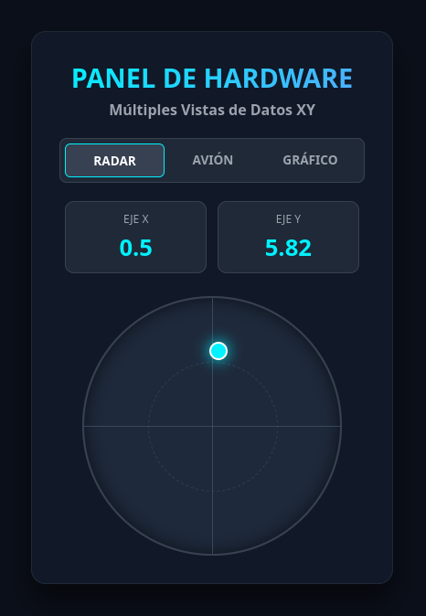
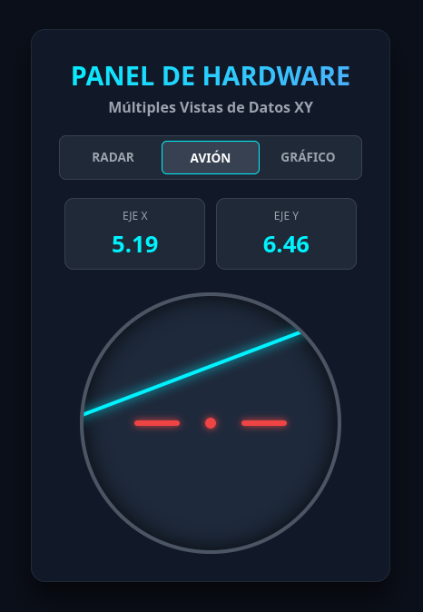
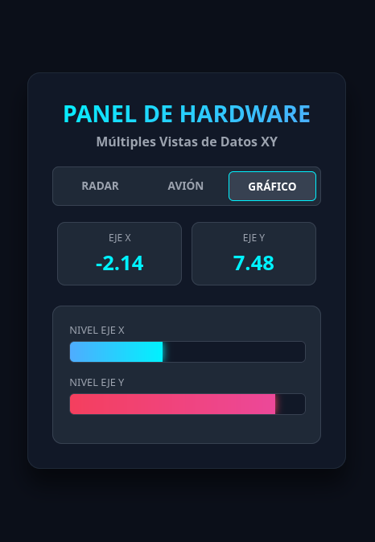

# Desarrollo de Software para Hardware (DCSH01)
## Evaluación Sumativa 4.2: Visualización Personalizada de Datos XY

Este repositorio contiene una versión modificada y optimizada del proyecto base para la adquisición y visualización de datos de telemetría provenientes de un sensor móvil (acelerómetro). La interfaz ha sido rediseñada utilizando un enfoque creativo que permite alternar dinámicamente entre tres paneles de visualización

---

## Características Incorporadas

* **Tema Oscuro Moderno:** Diseño con paleta de colores oscuros profundos y acentos en azul neón y rosa vibrante.
* **Sistema Multivista Integrado:** Navegación controlada desde el servidor que permite al usuario alternar mediante enlaces (`?view=`) entre tres modos de renderizado interactivo:
  1. **Visor de Radar:** Estilo mira telescópica, que traduce las coordenadas analógicas de los ejes en un indicador luminoso central.
  2. **Instrumento de Avión:** Un horizonte artificial clásico de aviación análoga donde la barra de horizonte rota (Eje X / *Roll*) y se desplaza verticalmente (Eje Y / *Pitch*) de forma dinámica detrás de una silueta fija.
  3. **Gráfico de Barras:** Barras de nivel independientes con gradientes lineales a la intensidad de los ejes.
* **Comportamiento de Palanca de Mando (Yoke):** El sistema mapea de manera interactiva la inclinación física del dispositivo móvil utilizado de forma horizontal (*landscape mode*), simulando fielmente la interfaz de control de una aeronave. 
* **Arquitectura de Red Invertida**: Se optimizó el backend para actuar como un cliente TCP secundario que corre en un hilo independiente (`threading`). El script se conecta activamente a la IP asignada por la red al servidor de la APK en el puerto `12345`, evitando bloqueos y garantizando una captura robusta que limpia etiquetas de texto nativas (`X:`, `Y:`).

---

## Interfaz en Funcionamiento

### 1. Vista Radar


### 2. Vista Instrumento de Avión (Horizonte Artificial)


### 3. Vista Gráfico de Barras


---

## Restricciones Obligatorias Cumplidas

De acuerdo con los requerimientos de la evaluación, la interfaz cumple estrictamente con las siguientes reglas de diseño:
1. **Sin JavaScript:** Todo el dinamismo de la interfaz, el procesamiento de las vistas y el posicionamiento en tiempo real se resuelven exclusivamente mediante lógica de servidor, recargas controladas y condicionales inline.
2. **Uso Exclusivo de Flask, HTML, CSS y Jinja:** Las posiciones relativas, rotaciones y desplazamientos se calculan en el backend y se renderizan usando el motor de plantillas Jinja.
3. **CSS en el `<head>`:** Todo el código de diseño de la interfaz se encuentra incorporado internamente dentro de las etiquetas `<style>` del bloque `<head>`.
4. **Uso Exclusivo de Selectores por ID:** No se empleó ninguna clase CSS (`.class`) para el comportamiento dinámico principal; los contenedores y estilos apuntan estrictamente a selectores únicos por identificador (`#id`).

---

## Estructura del Proyecto

```bash
.
├── app.py              # Servidor Flask y cliente TCP secundario
├── capturas
│   ├── vista-avion.png # Captura de pantalla del modo Horizonte Artificial
│   ├── vista-grafico.png # Captura de pantalla del modo Gráfico de Barras
│   └── vista-radar.png # Captura de pantalla del modo Radar interactivo
├── README.md           # Documentación del proyecto modificado
└── templates
    └── index.html      # Plantilla HTML con estilos por ID y lógica de posicionamiento/vistas Jinja
